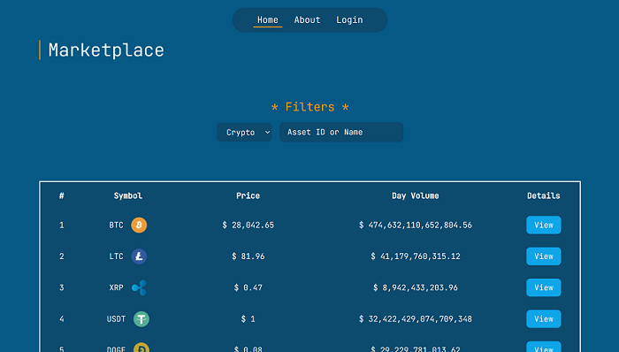

# virtual-crypto-wallet

## Français

Cette application est un portefeuille virtuel de crypto-monnaies créé à l'aide du Framework Vue.js. Elle permet à l'utilisateur d'afficher le cours des actifs cryptographiques ainsi que des devises fiduciaires (ou "fiat money" en anglais). Toutes les données de l'application proviennent de l'API "CoinAPI". Dans le futur, l'application offrira la possibilité virtuelle d'acheter ou de vendre des crypto-monnaies ou des devises fiduciaires, de faire des échanges d'un actif à l'autre (appelé également "swapping"), offrant ainsi toutes les fonctionnalités d'un portefeuille virtuel.

## English

This application is a virtual crypto wallet created using the Vue.js Framework. It allows the user to display the price of crypto assets as well as fiat money. All data in the application comes from the CoinAPI API. In the future, the application will offer the virtual possibility to buy or sell crypto-currencies or fiat currencies, to swap from one asset to another (also called "swapping"), thus offering all the functionalities of a virtual wallet.

## Screenshot

That's home page screenshot.



## Recommended IDE Setup

[VSCode](https://code.visualstudio.com/) + [Volar](https://marketplace.visualstudio.com/items?itemName=Vue.volar) (and disable Vetur) + [TypeScript Vue Plugin (Volar)](https://marketplace.visualstudio.com/items?itemName=Vue.vscode-typescript-vue-plugin).

## Customize configuration

See [Vite Configuration Reference](https://vitejs.dev/config/).

## Project Setup

```sh
npm install
```

### Compile and Hot-Reload for Development

```sh
npm run dev
```

### Compile and Minify for Production

```sh
npm run build
```

### Lint with [ESLint](https://eslint.org/)

```sh
npm run lint
```
